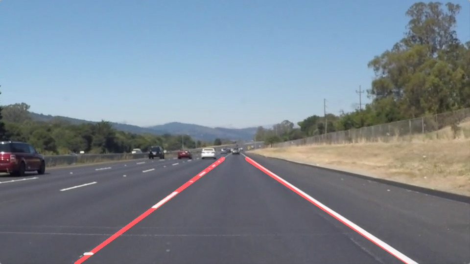
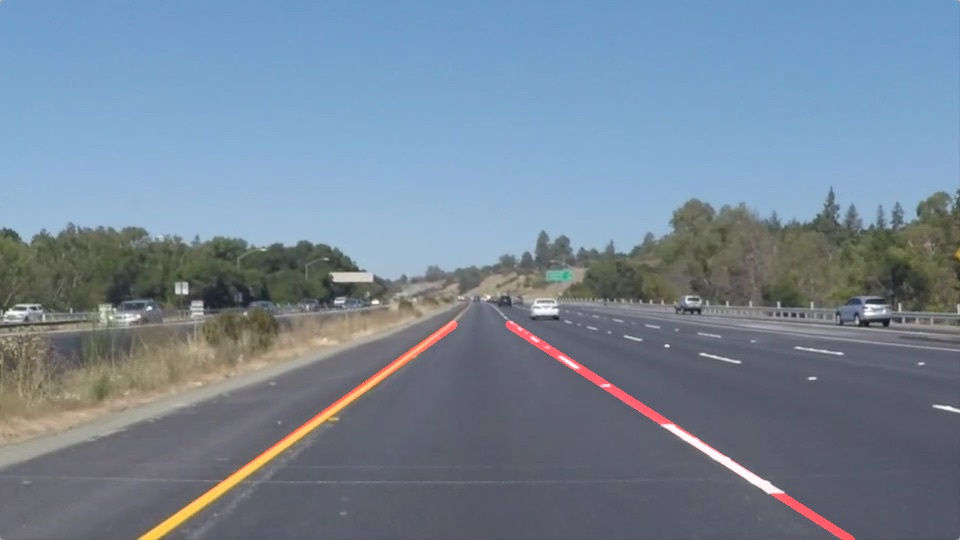

# **Finding Lane Lines on the Road** 

## Udacity Project - Self-Driving Car NanoDegree

<!---
You can use this file as a template for your writeup if you want to submit it as a markdown file. But feel free to use some other method and submit a pdf if you prefer.
-->

---

### 1.Overview

When we drive, we use our eyes to decide where to go.  The lines on the road that show us where the lanes are act as our constant reference for where to steer the vehicle.  Naturally, one of the first things we would like to do in developing a self-driving car is to automatically detect lane lines using an algorithm.

In this project I detect lane lines in images using Python and OpenCV.  OpenCV means "Open-Source Computer Vision", which is a package that has many useful tools for analyzing images.

The organization of my repo was shown as below:

* *P1.ipynb* : main code file which was written by jupyter notebook

* *laneKeep.py*: main code file which was written by python,which has some function of P1.ipynb
 
* *CarND-LaneLines-P1*: a folder contain lots of materials, including test images, test videos, lincense and so on. 

---
### 2.Goals

The goals of this project are the following:

* Make a pipeline that finds lane lines on the road

* Reflect on my work in this written report

[//]: # (Image References)

 [image1]: ./CarND-LaneLines-P1/test_images/solidWhiteCurve.jpg "original image"
 [image2]: ./CarND-LaneLines-P1/test_images_output/solidWhiteCurve.jpg "processed image"

---

### 3. The introduction of my solution pipeline. 

My pipeline consisted of 5 steps, which was described below:

* First, I converted the images to grayscale and define a *5* * *5* kernel size for Gaussian smoothing to suppressing noise and spurious gradients. 

* Second, I applied canny algorithm to the gray image to detect the edges. The edge pixels above the high threshold were detected and the pixels below the low threshold were rejected. Through conducting some experiments, the low threshold and high threshold were adjusted to *50* and *150*.
 
* Third, I estimated the region of interest(ROI) based on the size of image. The ROI is quadrilateral.

* Fourth, Hough Transform technology was used to find lane lines. By using the *hough_lines*(cv API), we can get multiple lines. In order to draw a single line on the left and right lanes, I modified the *draw_lines()* function and added *hough_lines_2_lane_lines()* function. These functions helped me divide the detected hough lines into two groups (left lane line group and right lane line group). However, some of the lines are not the real lane line. To solve this problem, I added function *filter_bad_lines()*, and this function applied linear regression to find the best of lines based on the points of hough lines in two groups.

* At last, drew the lane lines on the original image. As a result, this pipe can work well on the all test images and test videos except for the challenge.mp4.

---
### 4.Test results

 
**Solid white right curve:** 

 &nbsp; &nbsp; &nbsp; &nbsp; &nbsp; &nbsp; &nbsp; &nbsp; &nbsp; &nbsp; 
 

**Processed solid white right curve:** 

 &nbsp; &nbsp; &nbsp; &nbsp; &nbsp; &nbsp; &nbsp; &nbsp; &nbsp; &nbsp; 

 

 
**Solid yellow left curve:** 

 &nbsp; &nbsp; &nbsp; &nbsp; &nbsp; &nbsp; &nbsp; &nbsp; &nbsp; &nbsp; 
 

**Processed solid yellow left curve:** 

 &nbsp; &nbsp; &nbsp; &nbsp; &nbsp; &nbsp; &nbsp; &nbsp; &nbsp; &nbsp; 

 

---

### 5. Potential shortcomings with my current pipeline

This is just an rough version of lane finding solution. There are multiple scenarios where this solution would not work. 

* it is possible that other vehicles in front would trick my lane detect solution into thinking it was part of the lane. More work could be done to make the lane detector more robust.

* One potential shortcoming is that there are multiple scenarios where this lane detect algorithm would not work. For example, the roads with cracks might be mistaken as lane lines in challenge video. Besides this solution was not verified in dark light, bad weather, heavy traffic and so on.

* Another shortcoming could be that the lane lines images were processed by frame and frame, it causes large computation. My algorithm might be improved by using the relationship between each image frame of videos.

---

### 6. Possible improvements to my pipeline

* A possible improvement would be to take the advantage of the relationship between each image frame in a video.

* Another potential improvement could be setup multiple groups of parameters and apply different parameters in the different situations (bad weather, heavy traffic, etc).
